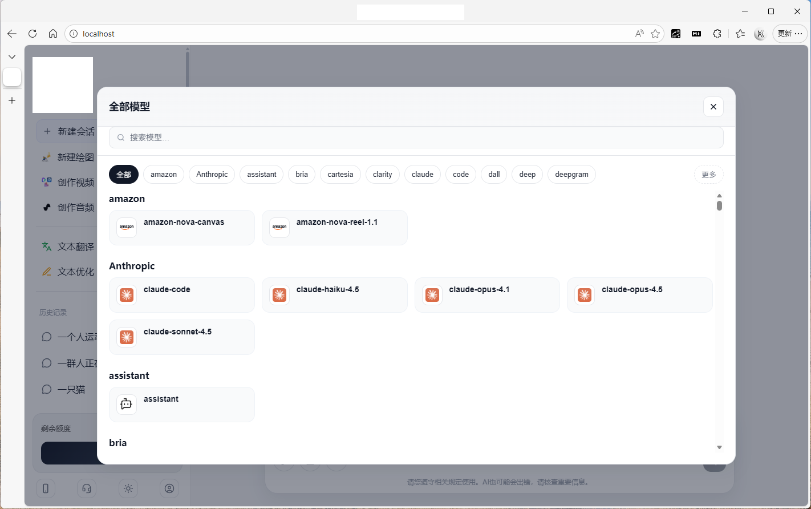
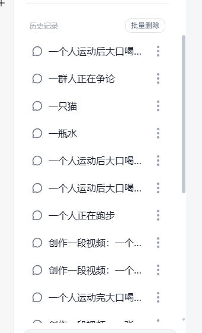
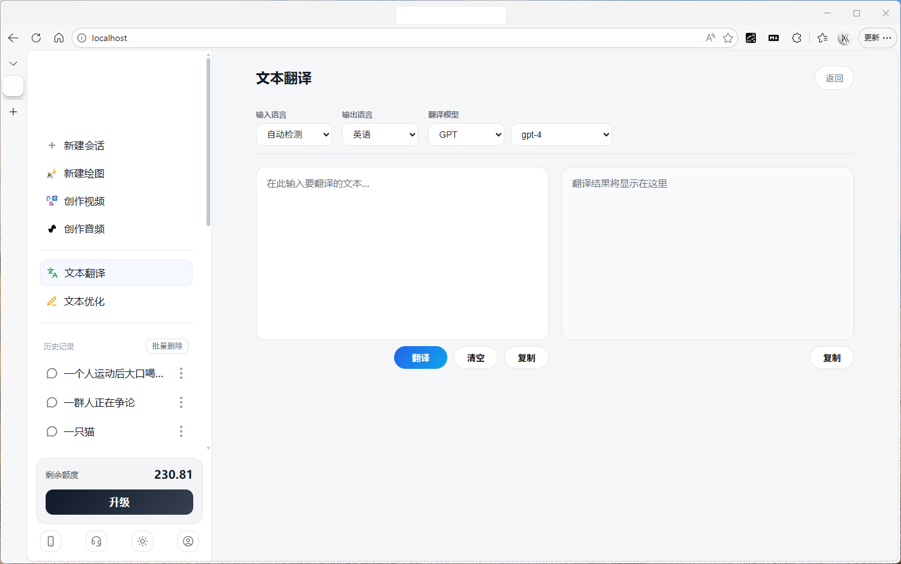
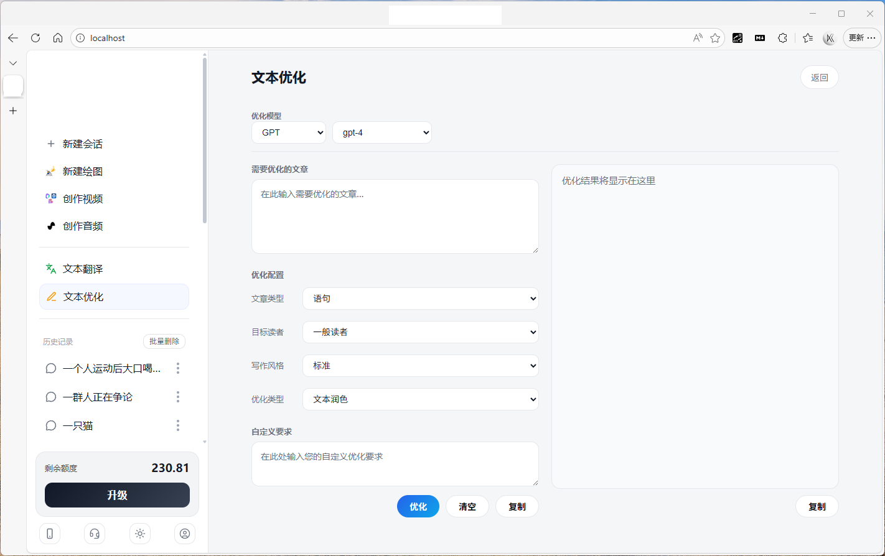
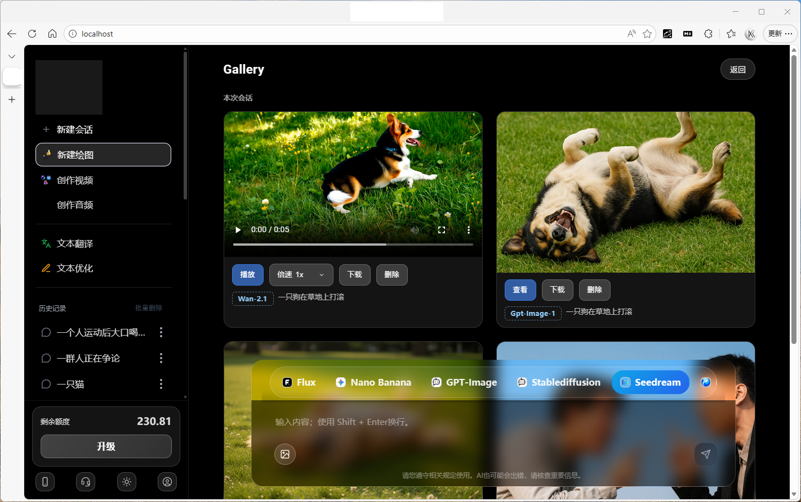
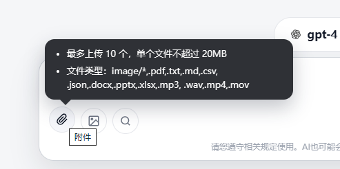
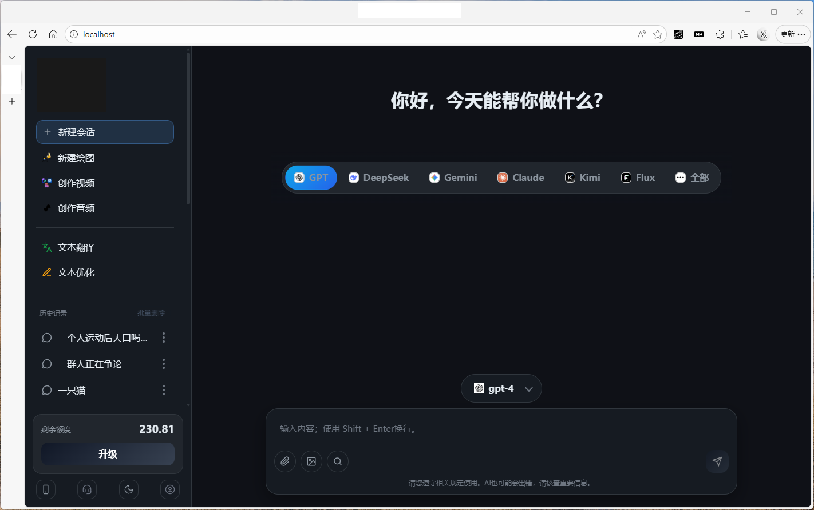
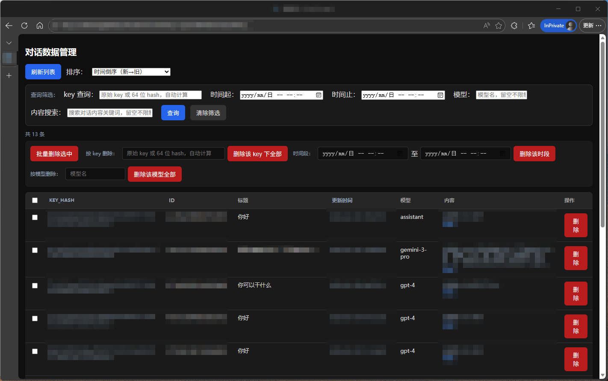

# ChatWebUI4OneHub

基于 Web 的 AI 对话前端，对接 OneHub 等兼容 OpenAI API 的后端服务。支持多模型对话、会话持久化、文本翻译、文本优化、绘图/视频/音频入口及管理后台。

## 功能概览

- **多模型对话**：支持 GPT、DeepSeek、Gemini、Claude、Kimi 等模型切换
  
- **会话管理**：新建会话、历史列表、重命名、删除，会话数据按用户 key 持久化

  

- **文本翻译**：类似翻译工具的双栏界面，可选源语言、目标语言和翻译模型

  

- **文本优化**：按文章类型、目标读者、写作风格、优化类型进行润色/改写/二次创作

  

- **快捷入口**：新建绘图、创作视频、创作音频（跳转或对接相应能力）

  

- **附件与图片**：支持上传图片及多种文档格式（PDF、txt、md、docx 等），多轮对话

  

- **主题**：日间/夜间模式切换

  

- **管理后台**：按 key、时间、模型、内容筛选对话，支持批量删除与单条删除

  

- **API 测试页**：填写 API 地址与 Key，测试连接并拉取模型列表

  

## 技术栈

- **前端**：纯 HTML + CSS + JavaScript，无构建步骤；Markdown 渲染（marked + DOMPurify）、KaTeX 公式、highlight.js 代码高亮
- **后端**：PHP 7+，提供会话 CRUD、列表、管理接口
- **数据库**：MySQL 5.7+ / MariaDB，表结构由 `setup.php` 初始化
- **AI 接口**：通过 HTTPS 请求对接兼容 OpenAI 的 API（如 `api.openai.com`）

## 目录结构

```
ChatWebUI4OneHub/
├── index.html          # 主对话页
├── admin.html          # 对话数据管理（需 URL 参数 key=管理员密钥）
├── apitest.html        # API 测试工具
├── setup.php           # 数据库初始化脚本
├── api/
│   ├── db.php                  # 数据库连接与配置
│   ├── get_chat.php           # 获取单条会话
│   ├── get_chat_history.php   # 获取用户会话列表
│   ├── put_chat.php           # 创建/更新会话
│   ├── delete_chat.php        # 删除会话
│   ├── update_chat_title.php  # 更新会话标题
│   ├── admin_list_all.php     # 管理端：列表
│   ├── admin_batch_delete.php # 管理端：批量删除
│   └── admin_delete_chat.php  # 管理端：单条删除
├── css/                # 样式（base、sidebar、main、chat、主题等）
├── js/                 # 前端逻辑（启动、对话、历史、翻译、优化、画廊、模型等）
├── logo/               # 模型图标等静态资源
├── docker/             # Docker：PHP Dockerfile、Nginx 配置、PHP 运行时配置
├── docker-compose.yml  # Mac 用 Compose
├── docker-compose.linux.yml  # Linux 用 Compose
├── docker-start-mac.sh / docker-start-linux.sh  # 启动与 setup 脚本
└── DOCKER.md、DOCKER-MAC.md、DOCKER-LINUX.md   # Docker 部署说明
```

## 环境要求

- PHP 7.4+（推荐 8.x），扩展：`pdo_mysql`、`json`、`mbstring`
- MySQL 5.7+ 或 MariaDB 10.3+
- Web 服务器（Apache / Nginx）或 PHP 内置服务器，且需支持 `api/` 下 PHP 的解析与重写（若使用统一入口）

## 安装与运行

> **重要：部署前请修改管理员密钥。** 当前默认值为 `1234567890`，仅为占位符，**必须**在以下 5 个文件中统一改为你自己的强密钥后再上线，否则管理后台可被他人访问：
> - `admin.html`、`js/app.boot.js`、`api/admin_list_all.php`、`api/admin_batch_delete.php`、`api/admin_delete_chat.php`

### 1. 克隆或下载项目

```bash
git clone <仓库地址>
cd ChatWebUI4OneHub
```

### 2. 配置数据库

复制或编辑 `api/db.php`（若存在独立配置），或直接修改 `setup.php` 中的数据库连接信息：

- `$dbHost`、`$dbPort`、`$dbName`、`$dbUser`、`$dbPass`、`$dbCharset`

在浏览器访问：

```
http://你的域名或本机/setup.php
```

或命令行：

```bash
php setup.php
```

输出 `OK: database and tables are ready.` 即表示数据库与表已创建/就绪。

### 3. 启动 Web 服务

**方式一：PHP 内置服务器（仅开发）**

```bash
php -S 0.0.0.0:8080 -t .
```

然后访问：`http://localhost:8080/`（主对话页）、`http://localhost:8080/apitest.html`、`http://localhost:8080/admin.html?key=你的管理员密钥`。

**方式二：Apache / Nginx**

将项目根目录配置为站点根目录，确保：

- `index.html` 为默认首页之一
- `api/*.php` 可被直接请求（或通过重写指向统一入口）
- 若前端通过相对路径请求 `api/`，需保证同源或配置 CORS

### 4. 管理后台

访问：`admin.html?key=你的管理员密钥`。  
默认密钥为 `1234567890`（占位用），**部署前务必**在上述 5 个文件中改为自设密钥并妥善保密。

## Docker 部署

项目提供 Docker Compose 一键部署，包含 **PHP-FPM + Nginx + MySQL**，无需本机安装 PHP/MySQL。

### 环境要求

- Docker
- Docker Compose

### 快速启动

| 环境 | Compose 文件 | 启动脚本 | 详细说明 |
|------|--------------|----------|----------|
| **Mac（含 M1）** 本地开发 | `docker-compose.yml` | `./docker-start-mac.sh` | [DOCKER-MAC.md](DOCKER-MAC.md) |
| **Linux** 服务器部署 | `docker-compose.linux.yml` | `./docker-start-linux.sh` | [DOCKER-LINUX.md](DOCKER-LINUX.md) |

**Mac：**

```bash
chmod +x docker-start-mac.sh
./docker-start-mac.sh start
./docker-start-mac.sh setup   # 首次部署：初始化数据库
```

**Linux：**

```bash
chmod +x docker-start-linux.sh
./docker-start-linux.sh start
./docker-start-linux.sh setup  # 首次部署：初始化数据库
```

或手动启动：Mac 使用 `docker-compose up -d`，Linux 使用 `docker-compose -f docker-compose.linux.yml up -d`；首次均需在 php 容器内执行 `php setup.php` 初始化库表。完整步骤与故障排查见 [DOCKER.md](DOCKER.md)。

### 访问与停止

- **应用**：http://localhost
- **数据库**：`localhost:3306`（账号密码见各 compose 中的 `MYSQL_ROOT_PASSWORD`）
- **停止**：`./docker-start-mac.sh stop` 或 `./docker-start-linux.sh stop`（或 `docker-compose down`），MySQL 数据卷会保留

### Docker 相关文件

```
docker/
├── php/
│   ├── Dockerfile       # PHP 7.3-fpm 镜像，pdo_mysql 等
│   ├── zz-docker.conf  # PHP-FPM 环境变量
│   └── zz-runtime.ini  # 运行时限与内存
└── nginx.conf          # Nginx 站点配置
docker-compose.yml      # Mac 用（含 platform）
docker-compose.linux.yml # Linux 用
docker-start-mac.sh     # Mac 启动/停止/setup 脚本
docker-start-linux.sh   # Linux 启动/停止/setup 脚本
DOCKER.md               # Docker 总览
DOCKER-MAC.md / DOCKER-LINUX.md  # 分平台详细指南
```

## 配置说明

- **AI 接口**：前端在 `js/app.chat.js`、`js/app.models.js`、`js/app.billing.js`、`js/app.search.js` 等处写死了 `https://api.openai.com/v1/...`。若对接自建或其它 OneHub 兼容服务，需在这些文件中将域名替换为你的 API 基础地址。
- **计费/额度**：依赖 `api.openai.com` 的 billing/usage 接口；若后端不同，需对应修改或关闭相关逻辑。
- **数据库**：会话表为 `chat_sessions`，主键为 `(key_hash, id)`，`key_hash` 为用户 key 的 SHA-256（64 位十六进制）。管理员接口支持按 key_hash、时间、模型、内容筛选与批量删除。

## 页面说明

| 页面           | 说明 |
|----------------|------|
| `index.html`   | 主对话界面：侧栏会话、模型切换、输入框、翻译/优化/画廊面板等 |
| `admin.html`   | 对话数据管理：列表、筛选、排序、批量删除、按 key/时间/模型删除 |
| `apitest.html` | API 测试：输入 API 地址与 Key，GET `/v1/models` 测试并展示模型列表 |

## 安全与敏感信息（部署/开源前必查）

以下为项目中的**敏感信息**与**特征信息**，对外发布或自建部署前请逐项检查并修改，避免泄露或误用。

### 敏感信息（必须修改）

| 类型 | 当前写死位置 | 说明 |
|------|----------------|------|
| **管理员密钥** | `admin.html`、`js/app.boot.js`、`api/admin_list_all.php`、`api/admin_batch_delete.php`、`api/admin_delete_chat.php`（共 5 处，需一致） | 默认值为 `1234567890`，仅作占位。**部署前必须改为自设强密钥，并勿将真实密钥提交到公开仓库。** |
| **MySQL 密码** | `docker/php/zz-docker.conf`（`env[DB_PASS]`）、`docker-start-mac.sh`、`docker-start-linux.sh`、`DOCKER.md` 内 .env 示例 | Docker 默认 root 密码。**生产/对外部署前请在 compose 与脚本中改为强密码，或通过 .env 注入。** |

### 特征/品牌信息（按需修改）

若用于自建或二次分发，建议替换为自有域名或占位符：

| 类型 | 出现位置 | 说明 |
|------|----------|------|
| **AI API 域名** `api.openai.com` | `js/app.chat.js`、`js/app.models.js`、`js/app.billing.js`、`js/app.search.js` | 对话、模型列表、计费、搜索请求的 base URL |
| **站点/面板链接** `yourdomain.com`、`img.yourdomain.com` | `index.html`（标题、Logo、推广链接、二维码、客服/个人中心跳转）、`apitest.html`（返回首页、Logo、示例 API）、`js/app.boot.js`（跳转 panel/首页） | 品牌、外链与前端跳转；可改为自建站或占位 |


## 开源与免责

- 本项目为前端 + 简单 PHP 后端的对话 UI，AI 能力依赖外部 API。
- 使用第三方 API 时请遵守其服务条款与用量限制；

